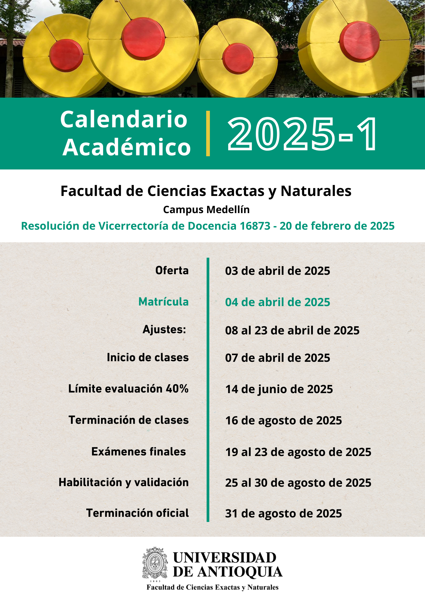

# Cronograma de Actividades 2025-1

---

| Semana | Fecha    | Unidad | Tema |
|--------|----------|--------|------|
| 1      | 08/04    | 1      | Introducción al curso y comandos básicos de Linux |
| 1      | 10/04    | 1      | Repaso Python (variables, estructuras de datos, recursividad, condicionales, funciones) |
| 2      | 22/04    | 1      | Repaso Python (Librerías) |
| 2      | 24/04    | 2      | Representación numérica y complejidad |
| 3      | 29/04    | 2      | Errores: redondeo, truncamiento, sustracción cancelativa, precisión de la máquina |
| 3      | 01/05    | 3      | Ecuaciones de una variable: Algoritmo de la bisección |
| 4      | 06/05    | 3      | Ecuaciones de una variable: Algoritmo de la regla falsa y punto fijo |
| 4      | 08/05    | 3      | Ecuaciones de una variable: Algoritmo de la secante |
| 5      | 13/05    | 3      | Ecuaciones de una variable: Algoritmo de Newton-Raphson |
| 5      | 15/05    | 3      | Ecuaciones trascendentales y raíces |
| 6      | 20/05    | 4      | Interpolación: Lineal y Polinomios de Lagrange |
| 6      | 22/05    | 4      | Interpolación: Método de Newton (Diferencias divididas) |
| 7      | 27/05    | 4      | Interpolación: Método de Hermite y Splines Cúbicos |
| 7      | 29/05    | -      | Parcial I (Unidades 2, 3 y 4) |
| 8      | 03/06    | 5      | Diferenciación numérica: método de la diferencia hacia adelante y de la diferencia central, segundas derivadas numéricas, errores |
| 8      | 05/06    | 5      | Integración numérica: Método cuadratura y trapezoidal |
| 9      | 10/06    | 5      | Integración numérica: Método de Simpson (compuesto) |
| 9      | 12/06    | 5      | Integración numérica: Método de la cuadratura gaussiana |
| 10     | 17/06    | 5      | Integración numérica: Método de von Neumann para integrales (Monte Carlo) |
| 10     | 19/06    | 5      | Integración numérica: Integrales impropias y múltiples |
| 11     | 09/07    | 6      | Álgebra lineal y matrices en Python |
| 11     | 11/07    | 6      | Solución de sistemas de ecuaciones lineales (Cramer, Eliminación Gaussiana) |
| 12     | 16/07    | 6      | Método de Gauss-Jordan, Factorización LU |
| 12     | 18/07    | 6      | Métodos Iterativos: Jacobi y Gauss-Seidel |
| 13     | 23/07    | 6      | Matrices complejas, hermiticidad, autovalores y autovectores |
| 13     | 25/07    | 7      | Ecuaciones Diferenciales: Método de Euler |
| 14     | 30/07    | 7      | Ecuaciones Diferenciales: Método de Runge-Kutta |
| 14     | 01/08    | 7      | Ecuaciones Diferenciales de orden superior |
| 15     | 06/08    | 7      | Parcial II (Unidades 5, 6 y 7) |
| 15     | 08/08    | 8      | Estadística: Regresión lineal |
| 16     | 13/08    | 8      | Estadística: Regresión no lineal |
| 16     | 15/08    | -      | Avance Proyectos |
| 17     | 20/08    | -      | -- |
| 17     | 22/08    | -      | Entrega y sustentación de proyectos |
